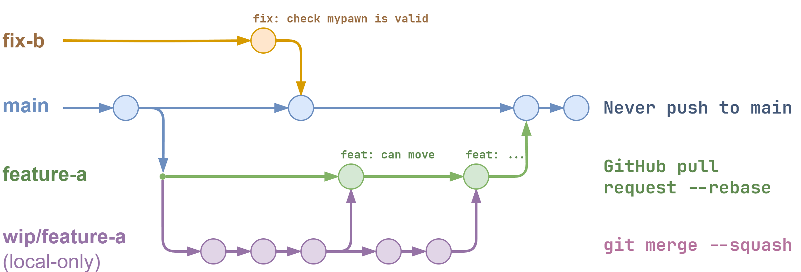

[comment]: <> (This is a comment, it will not be included)
# GGJ25
This is the repository for the Game developed at the **Global Game Jam 2025**, developed with Unreal Engine 5.5.

## About
The theme for this jam is **Bubbles**. 

## Getting Started
It is recommended to get the Visual Studio Community with the MSVC Compiler to be able to build the project from source.

1. Clone the repository
2. Double-click GGJ25.uproject to build and open the project
3. Add feature or content pack: Starter Content
4. Open GGJ25.uproject and start developing

If this does not work: Right-click and open GGJ25.uproject with Rider, or right-click, "Generate Visual Studio project files" -> open with Visual Studio to build the project from source. You can also delete all generated files by double-clicking the "cleanup.bat" and perform a clean re-build subsequently.

## Contributing


To keep the project base clean and to reduce maintenance time it is recommended to follow a certain workflow. In our case the **main branch** is supposed to always provide a version of a working project i.e. you should be able to clone the repository from  here and run the game without errors and start to make your own modifications.

To contribute you should clone the repository, create a branch that is going to be the base branch for your modifications, usually a **feature branch**, e.g. *floating-pawn*. From here you straight branch off a **local-only work-in-progress branch**, e.g. *wip/floating-pawn*.  Here you can make all your commits until you finally decide to **squash merge** them locally back into your feature branch *floating-pawn*. You can push the feature branch to the remote repository. Before you do this, test the state of your work. It should not break anything. Also check Unreal's output log for any warning (orange) or error (red) (Video: [interactive rebase](https://www.youtube.com/watch?v=42392W7SgnE)). 

Once you finished all your work on this branch, it's time to create a **pull request** on GitHub, assign a member of the team for review and let this person perform a **rebase** onto the main branch (Video: [Squash](https://youtu.be/42392W7SgnE?si=yw6w4plfdMt1NsXC)). You can update your local branches by checking out the main branch, pulling from the remote repository and rebasing your feature branch on the updated main branch. Then you can merge your feature branch back into your wip branch.

You should follow the "commit early and often" rule for your local wip branch. Here, the commit messages not matter. However, anything that is pushed to the remote repository should follow the [conventional commits](https://www.conventionalcommits.org/en/v1.0.0/). You can also mention which issue is closed or referenced, e.g. "feat: add crazy cat lady, closes #4".

Here a rough example of the workflow in the command line:
```
git clone <url-to-repository>
git checkout -b floating-pawn
git checkout -b wip/floating-pawn
// make changes
git add .
git commit -m "add floating pawn; movement does not work properly"
// make changes
git add .
git commit -m "fix floating pawn movement"
git checkout floating-pawn
// make changes
git merge --squash wip/floating-pawn
git add .
git commit -m "feat: pawn movement"
git pull
git push
```

## Style Guide
When working in Unreal Engine, please keep the naming of folders and files consistent. The already existing files give an orientation. The naming conventions are derived from the [Allar UE5 Styleguide](https://github.com/Allar/ue5-style-guide).

### Asset Naming
Asset names should not include their type, instead they contain a abbreviation prefix, e.g. **SKM_MyCharacter**, for the skeletal mesh of *MyCharacter*. If it's a Blueprint, they are usually prefixed with BP_NameConcreteType, e.g. **BP_GGJ25GameMode**.

### Directory structure
The root directory is `Game/Content/GGJ25`. Anything, part of the game should be created in this root folder or copied into it before modification. Assets that have a 1:1 relationship should reside in their dedicated folder. E.g. *SKM_MyCharacter* goes in same folder as *BP_MyCharacter*. Siblings, assets derived from the same type, should be moved into their own subfolders. Assets shared among siblings, like an animation blueprints, should be placed in the parent folder of the siblings. Generally common assets, like a parent material that is used for unrelated assets, can be placed in the root folder under *Materials*.

### Further Notes
- Please assign materials to their mesh assets they belong to in the content browser, not in the world outliner.
- Import assets in their desired scale if possible and try to avoid chained scaling of Actors.
- Never reference assets in your developer folder. The other way around is possible.